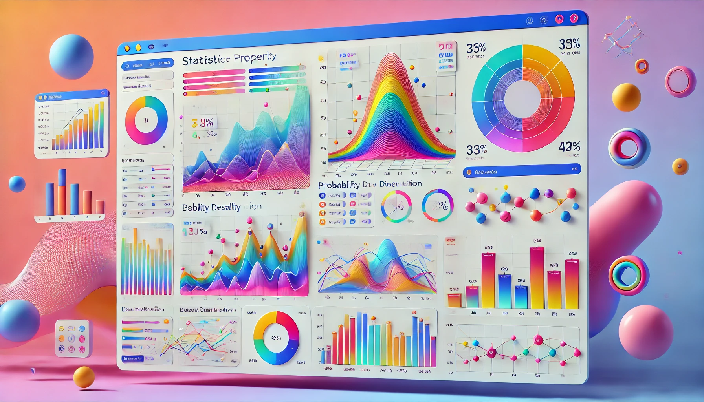

# Codex-Stats-Lab

Codex Stats Lab is a visual, interactive dashboard for exploring how Poisson, Beta, and Log-Normal distributions behave. Built with Streamlit, it pairs dynamic plots with plain-language explanations so you can tweak parameters, watch the curves respond, and connect the math to real-world questions. Whether you're a student, analyst, or curious stakeholder, the app offers an approachable way to understand why these distributions matter and how they inform data-driven decisions.

## Technologies Used


[](https://streamlit.io/)
[](https://github.com/)
[](https://www.python.org/)
[](https://pandas.pydata.org/)
[](https://github.com/features/actions)


# Links

Application - 

Codelabs - 




# Description:

This dashboard allows users to:

Interactively visualize Poisson, Beta, and Log-Normal distributions

Understand real-world applications and properties of each distribution

Bridge the gap between data science practitioners and business stakeholders with layered explanations

Highlight how AI agents like Codex can enhance data science development workflows


# About:

Statistical distributions underpin many real-world processes from website clicks to modeling uncertainty in finance and health. However, many tools lack intuitive interfaces or contextual explanations.

Codex Stats Lab solves that by:

**1.Offering simple, side-by-side plots:**

**2.Layered insights: from math-based definitions to business analogies:**

**3.Leveraging Codex for code reusability and component modularity:**

# Key Features:

**📈 Distribution Explorer Page:**
Dynamic visualization of Poisson, Beta, and Log-Normal distributions with parameter controls and summary stats.

**🎓 Understand the Stats Page:**
Clear, non-technical explanations with real-world analogies for each distribution.

**🏠 Home Page:**
Overview of the project, built-in navigation, and creator details.


## Requirements
```
streamlit
numpy
pandas
matplotlib
seaborn
scipy

```

## Project Folder Structure

```
📦 
├─ .gitignore
├─ .streamlit
│  └─ config.toml
├─ LICENSE
├─ README.md
├─ app.py
├─ assets
│  ├─ beta_dist.png
│  └─ lognormal_dist.png
├─ pages
│  ├─ 1_Distribution_Explorer.py
│  └─ 2_Understand_the_Stats.py
├─ requirements.txt
└─ src
   ├─ __init__.py
   ├─ plots.py
   ├─ simulations.py
   └─ utils.py
```
©generated by [Project Tree Generator](https://woochanleee.github.io/project-tree-generator)

## How to run the Application locally

To run the application locally, follow these steps:

1. Clone the repository to get all the source code on your machine.

2. Install the required dependencies

3. Create a virtual environment and activate Streamlit

4. Launch the Streamlit app and explore the dashboards


# Setup Commands

### Create virtual environment

```
git clone "repository link"
```

### Install requirements

```
pip install -r requirements.txt
```

### Run streamlit application

```
streamlit run app.py
```

# ATTESTATION:

I ATTEST THAT I HAVEN’T USED ANY OTHER STUDENTS’ WORK IN MY ASSIGNMENT AND ABIDE BY THE POLICIES LISTED IN THE STUDENT HANDBOOK.
